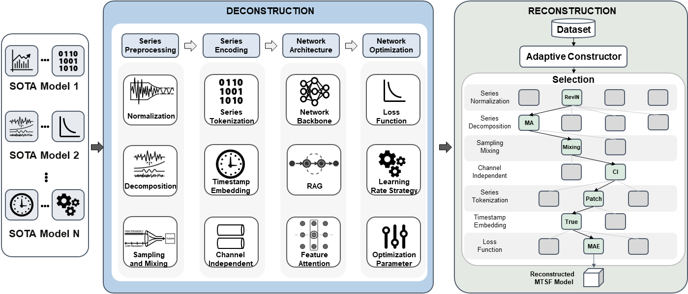
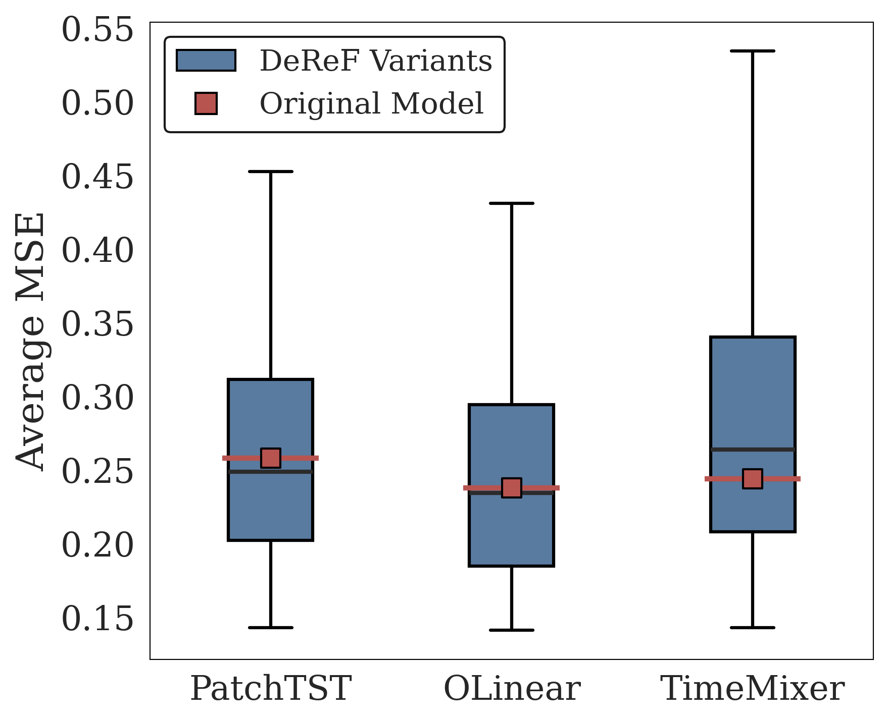
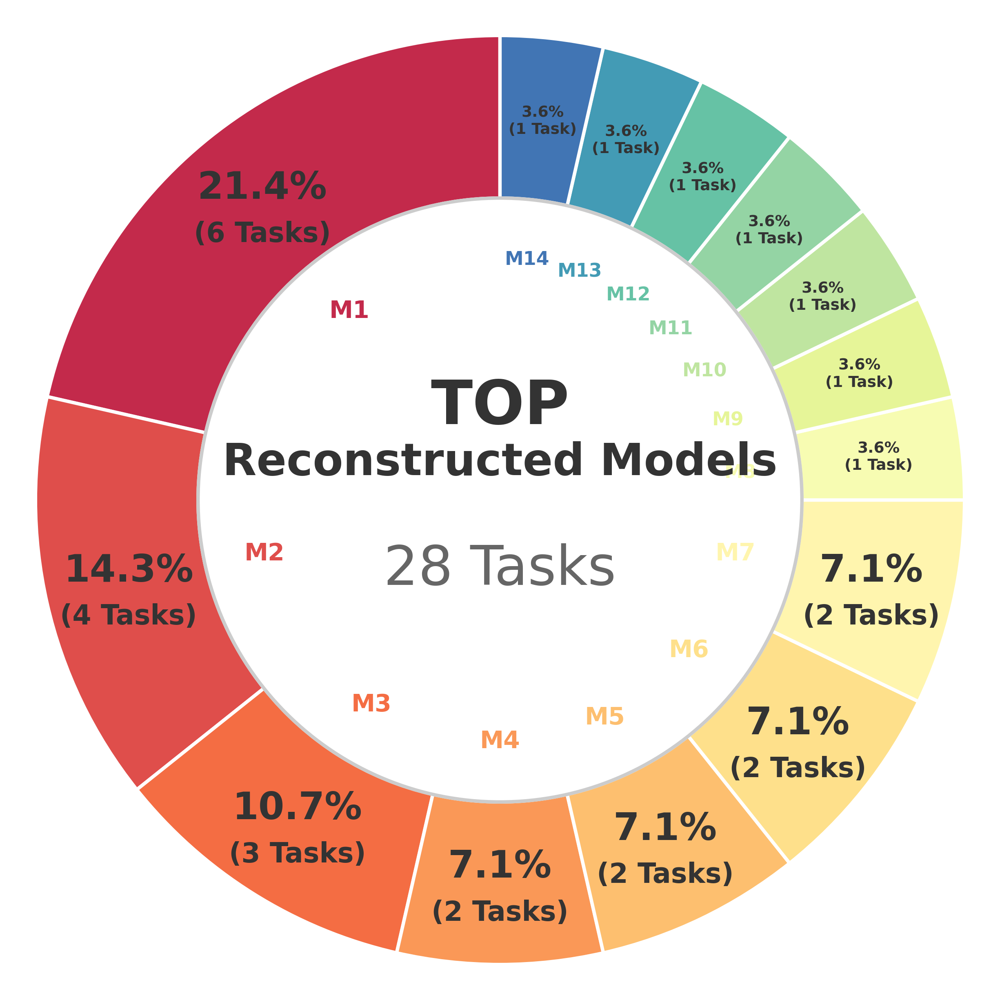
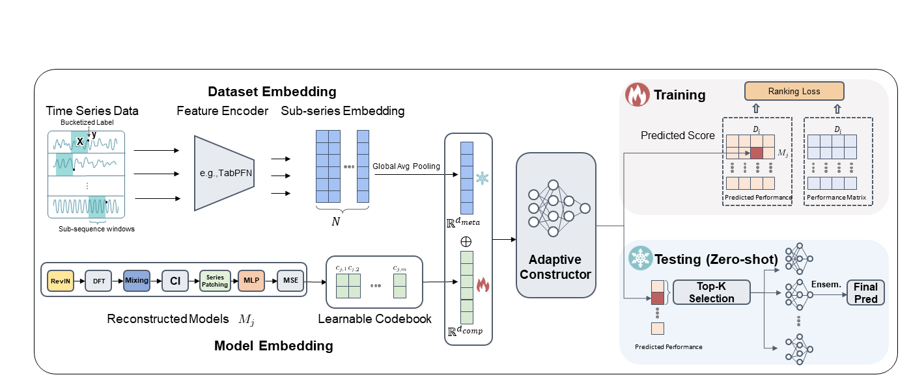
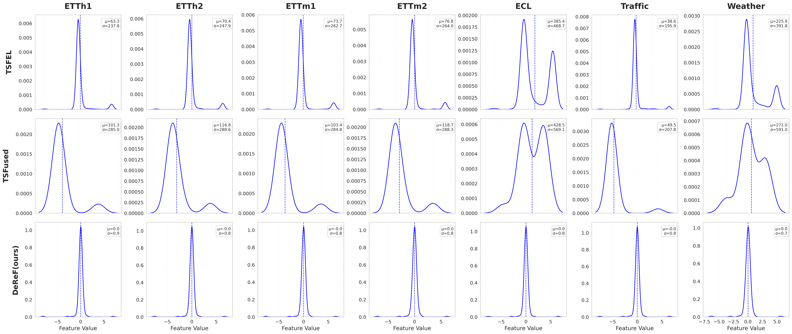

# DeReF: Deconstruction and Reconstruction Framework for Adaptive Multivariate Time Series Forecasting

Official implementation of **DeReF**. 

DeReF (Deconstruction and Reconstruction Framework) is an adaptive framework designed for automated Multivariate Time Series Forecasting (MTSF). It shifts the paradigm from static model selection to dynamic architecture synthesis.

---

## 🌟 Framework Overview

<p align="center">
  
</p>

**The Overview of the DeReF framework.** The pipeline begins with **Deconstruction**, breaking monolithic models into functional components. In **Reconstruction**, deep meta-features guide the adaptive constructor to assemble optimal configurations for target data.

---

## 💡 Motivation: The Value of Deconstruction & Reconstruction

| (a) Multi-component Analysis | (b) Win-rate Distribution |
|:-:|:-:|
|  |  |

**Insight 1: The Value of Modular Deconstruction.** As shown in (a), reconstructed models significantly **outperform standard SOTA models** on Weather dataset, confirming the value of modular design and the potential of finding better configurations within the deconstructed space.

**Insight 2: The Need for Adaptive Selection.** As shown in (b), the win-rate distribution of top reconstructed models across 28 tasks reveals that the leading configuration secures only a 21.4% win rate. This proves that **no single reconstructed model dominates** all scenarios, quantifying the critical need for adaptive reconstruction.

---

## 🛠️ Methodology: Predictability-Aware Meta-Features

<p align="center">
  
</p>

**Pipeline of Predictability-Aware Meta-Feature Extraction.** This module transforms continuous series into discretized classification tasks, leveraging the in-context learning capability of **TabPFN**. We extract dense embeddings from the frozen encoder, capturing intrinsic input-output mapping logic. These representations serve as robust proxies for zero-shot architectural recommendation.

### 📊 Meta-Feature Statistical Properties

<p align="center">
  
</p>

Our meta-features demonstrate a favorable **Gaussian-like distribution**, which provides a better inductive bias for downstream neural network training. In contrast to baselines (like TimeFuse) which often show irregular or sparse distributions, our proposed predictability-aware meta-features offer superior optimization stability and representation power.

---

## 📂 Code Structure

The project is organized as follows:

- `data_provider/`: Data loading and preprocessing utilities for various benchmarks.
- `exp/`: Core experimental logic, including meta-training and evaluation loops.
- `layers/`: Implementation of modular components (e.g., normalization, attention, decomposition).
- `meta/`: Predictability-aware meta-feature extraction based on TabPFN.
- `models/`: Architecture definitions for reconstructed models and backbones.
- `utils/`: Common utilities for logging, metrics, and visualization.
- `run_meta_dl.py`: Main entry point for meta-learner training and adaptive selection.
- `run.py`: Script for training and evaluating individual model configurations.
- `models/TSGym.py`: DeReF Model python file.

<!-- ---

## 🛠️ Environment Setup

```bash
# Create and activate environment
conda create -n deref python=3.9
conda activate deref

# Install dependencies
pip install -r requirements.txt
```

---

## 📝 Citation

If you find this work useful, please consider citing:

```bibtex
@inproceedings{houch2024deref,
  title={DeReF: Deconstruction and Reconstruction Framework for Adaptive Multivariate Time Series Forecasting},
  author={...},
  booktitle={Proceedings of the 41st International Conference on Machine Learning (ICML)},
  year={2024}
}
``` -->